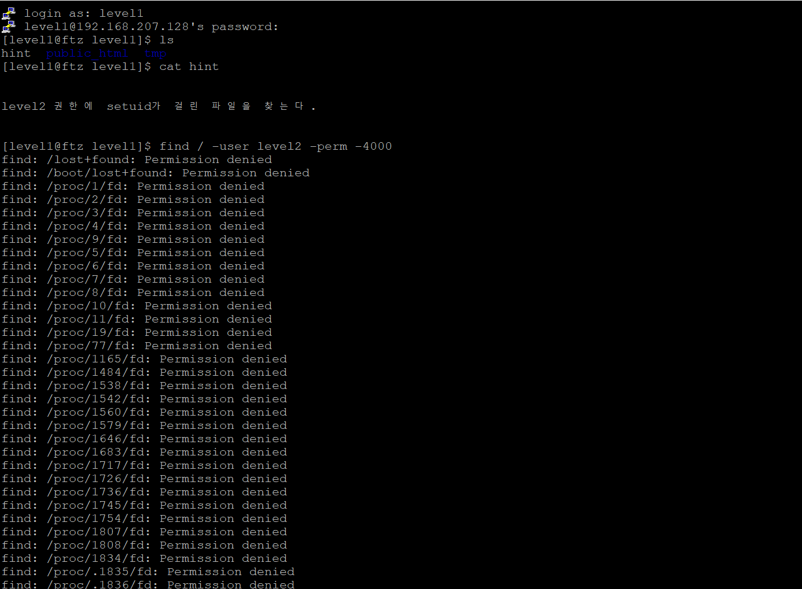
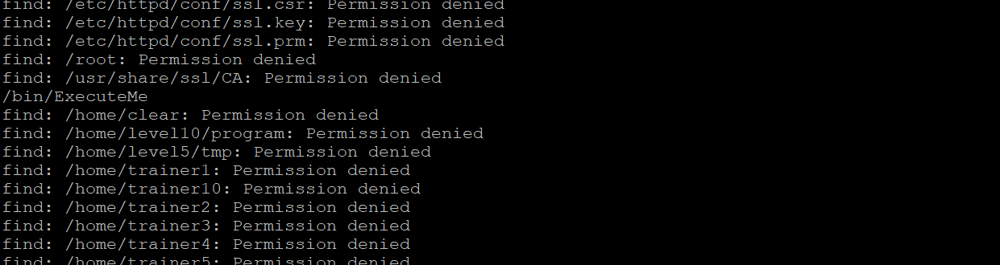
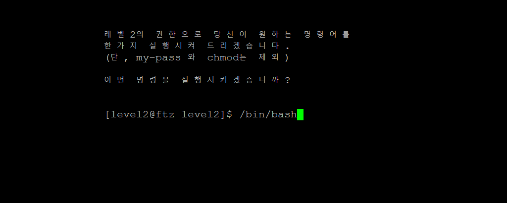
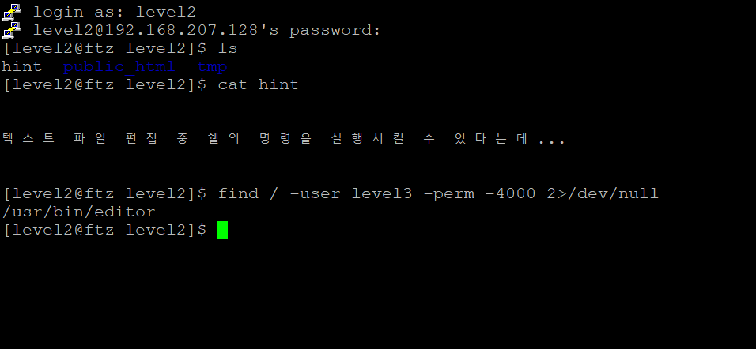

# Summer Study - Pwnable

## Week 1 - FTZ

일단 리눅스에 대한 기초가 정말 하나도 없는 상태이기에 Trainer 과정을 모두 완료한 후, level로 진입하였다. Trainer 과정에서 리눅스의 기본적인 명령어에 대하여 익힐 수 있었고, 리눅스의 권한이나 해킹의 원리등을 대강 파악하는 데 많은 도움이 되었다. 그리고 실제 Level1에 진입하면서, 정말 시스템 해킹을 접하게 되면서 많이 설렜던 것 같다,

#### 1) Level 1

Trainer 과정에서 배웠던 대로 SetUID 권한이 있는 파일을 조작하는 것이 관건일 것이다. 이를 위해 find 명령어를 사용하여보자. 사실 -4000이 아니라 4000을 입력하는 바람에 상당히 고생해서 결국에 Write-up을 찾아보고서는 허망하게 풀이법을 찾아낸 문제이다.

야속하게 Permission denied 사이에 끼워져 있는 실행파일 하나.

ExcuteMe를 실행하여보면,

하나의 명령을 실행시킬 수 있다는 창이 나온다. 여기서 또 막혔다가 Write-up을 보고 간신히 찾았다.

사용자가 접속하면 /bin/bash의 파일을 가장 먼저 실행시킨다는 것에서 알 수 있는 대목이었을텐데.

ExecuteMe에 /bin/bash를 입력하면 우리기 찾던 셸이 나오고, 이를 이용해 my-pass를 실행시키면 키가 나온다.

#### 2) Level 2

상당히 깜짝 놀랐던 문제이다. 

