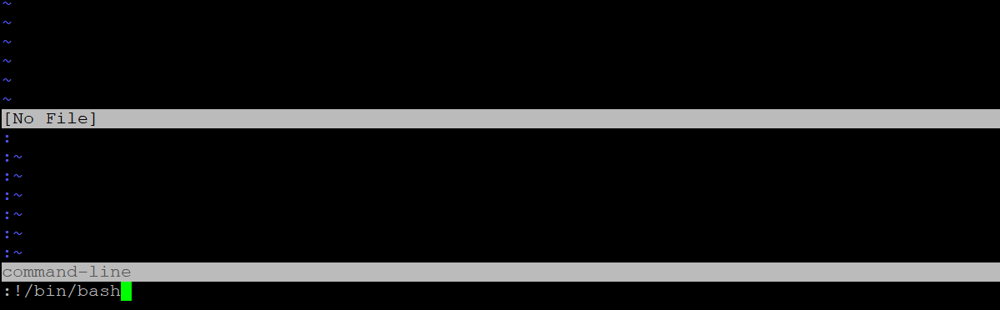
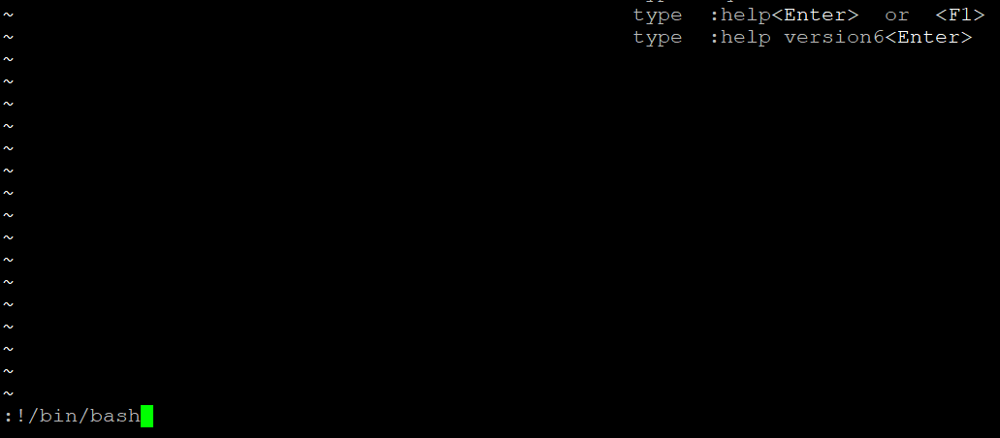
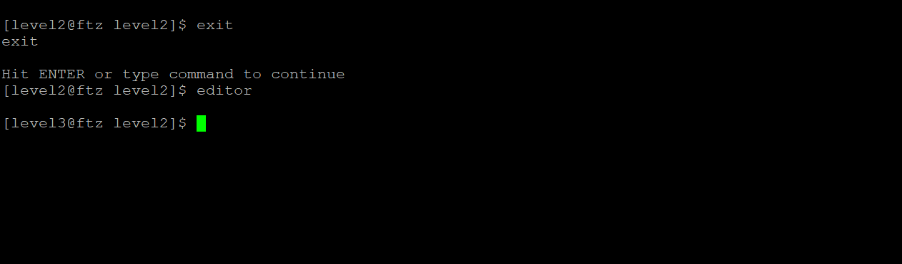
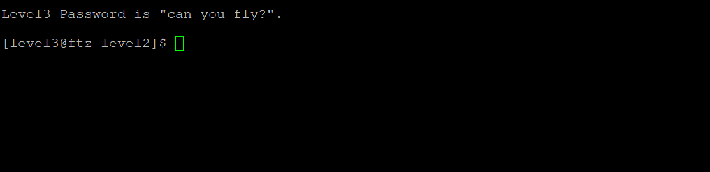
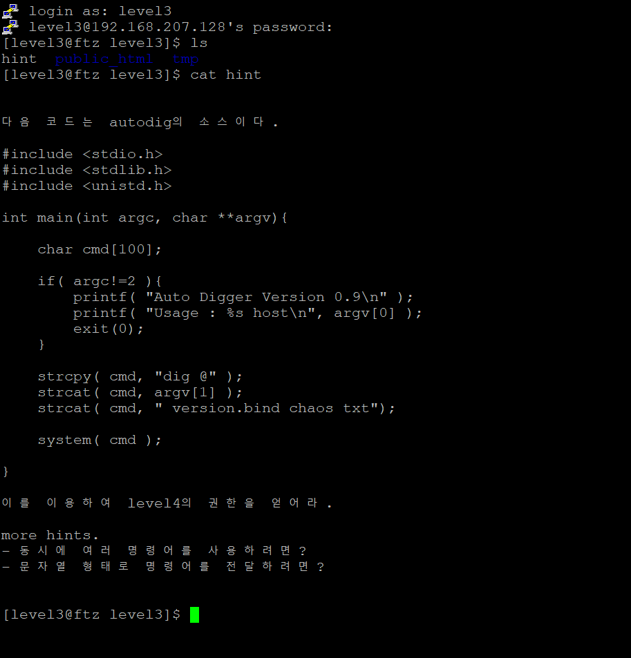
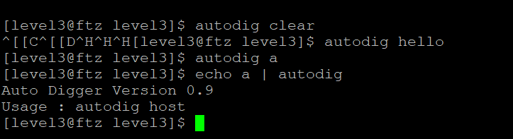
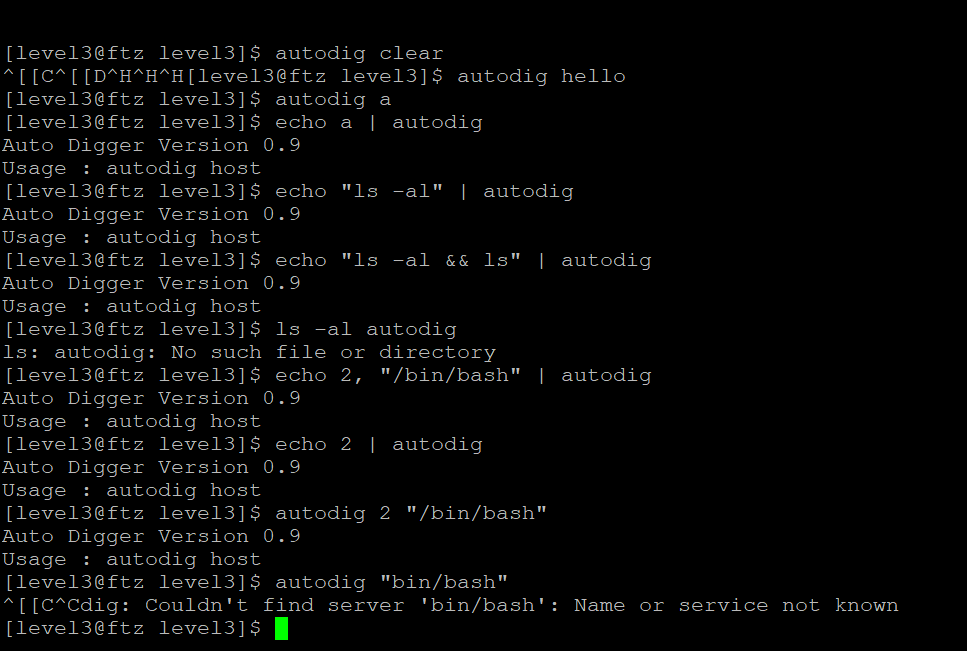
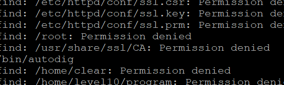
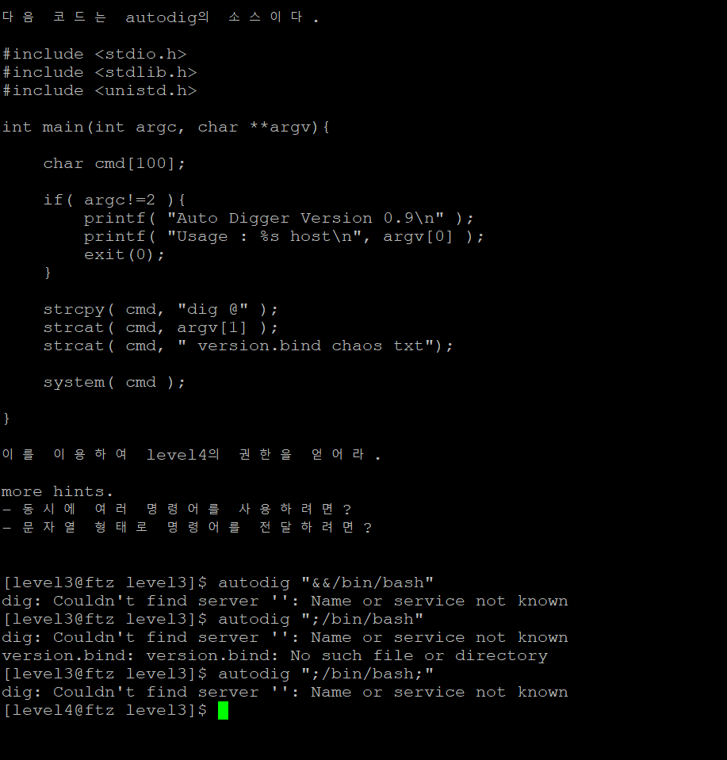
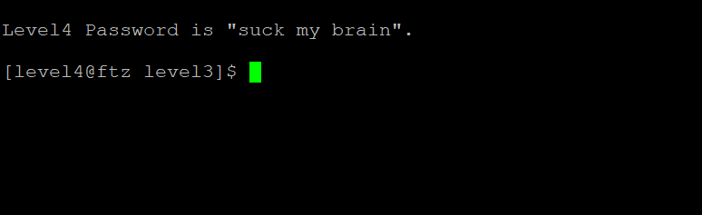

# Summer Study - Pwnable

## Week 1 - FTZ

일단 리눅스에 대한 기초가 정말 하나도 없는 상태이기에 Trainer 과정을 모두 완료한 후, level로 진입하였다. Trainer 과정에서 리눅스의 기본적인 명령어에 대하여 익힐 수 있었고, 리눅스의 권한이나 해킹의 원리등을 대강 파악하는 데 많은 도움이 되었다. 그리고 실제 Level1에 진입하면서, 정말 시스템 해킹을 접하게 되면서 많이 설렜던 것 같다,

#### 1) Level 1

Trainer 과정에서 배웠던 대로 SetUID 권한이 있는 파일을 조작하는 것이 관건일 것이다. 이를 위해 find 명령어를 사용하여보자. 사실 -4000이 아니라 4000을 입력하는 바람에 상당히 고생해서 결국에 Write-up을 찾아보고서는 허망하게 풀이법을 찾아낸 문제이다.

야속하게 Permission denied 사이에 끼워져 있는 실행파일 하나.

ExcuteMe를 실행하여보면,

하나의 명령을 실행시킬 수 있다는 창이 나온다. 여기서 또 막혔다가 Write-up을 보고 간신히 찾았다.

사용자가 접속하면 /bin/bash의 파일을 가장 먼저 실행시킨다는 것에서 알 수 있는 대목이었을텐데.

ExecuteMe에 /bin/bash를 입력하면 우리기 찾던 쉘이 나오고, 이를 이용해 my-pass를 실행시키면 키가 나온다.

#### 2) Level 2

상당히 깜짝 놀랐던 문제이다.  vim에서 외부 쉘을 실행시킬 수 있는 방법이 있는 지 잘 몰랐고, 이는 공유 메모리 문제에서 코드를 짤 때 잘 이용하였다. hint를 나갔다 열기 귀찮다보니....

일단 상위 레벨의 권한을 가지고 있는 파일을 찾아보면 editor가 존재한다. 이를 이용하여 풀면 될텐데, vim이 이 에디터에 연결되어있는줄 알고 바보같이 vi를 입력해버렸다.

그렇게 vi의 bash를 이용해봤지만, 돌아오는 것은 Level2의 쉘. 이 vi와 저 editor가 다르다는 것을 그제서야 안 것이다.

그렇게 editor의 bash를 이용하여 

Level3의 쉘을 획득한다.

이 문장이 얼마나 얄밉던지. 이 문제를 통해서 vim 편집기 사용법도 확실히 익혀서 나중에 웹서버 구축 때 MariaDB와 Tomcat9의 서버파일들을 헤집고 다닐 때 nano없이 유용하게 사용하였다. 오히려 익숙해지면 상당히 편해질 것 같은 느낌.

#### 3) Level 3

코드를 하나 던져주고서는 다음 명령어로 어떻게 넘어갈 지 알아보란다. 이 문제를 거의 유일하게 혼자 힘으로 풀었다.

일단 코드 분석하기 전에 뭐 하는 놈인지나 먼저 한 번 툭 건들여보자.

너 Auto Digger Version 0.9인거 뭐 어쩌라고.

argc는 넘어오는 인자의 개수이고, argv는 인자로 넘어온 문자열의 배열이다. 따라서 이 코드를 대충 해석해보자면, 인자가 1개 (argc는 프로그램 자신의 위치를 하나 더 인자로 삼는다) 일 때, dig@ + 인자 + version.bind chaos txt를 실행시킨단다.

사실 argc의 인자 개수 원리를 몰라서 자꾸 2개를 주려 발악했었다.

처음에는 dig의 취약점을 분석하는 것인가 해서 dig를 찾아보니 DNS 관련 함수. 그렇게 몇 번 삽질을 하고 밑의 '동시에 여러 명령어를 사용하려면?'을 보니, 바로 생각나는 것이 있었다. $, |, ; 등의 명령을 연결해주는 기호들.

일단 autodig가 확실히 상위 레벨의 권한을 가지고 있다는 것을 확인한 후,

시도해보니,  Level4의 쉘이 획득된 것이 보인다. 처음으로 자력으로 푸니 얼마나 기분좋던지. 하지만 이 후 모든 문제는 감도 못잡고 Write-up이나 뒤져보게 될 줄 몰랐다.

저 단어를 보니 BrainFuck이라는 프로그래밍 언어가 생각나는 것은 기분 탓일까. 아마 어셈이 BrainFuck같은 느낌이라서 그런 것일지도.

#### 4) Level 4