# Summer Study - Pwnable

## Week 1 - FTZ

일단 리눅스에 대한 기초가 정말 하나도 없는 상태이기에 Trainer 과정을 모두 완료한 후, level로 진입하였다. Trainer 과정에서 리눅스의 기본적인 명령어에 대하여 익힐 수 있었고, 리눅스의 권한이나 해킹의 원리등을 대강 파악하는 데 많은 도움이 되었다. 그리고 실제 Level1에 진입하면서, 정말 시스템 해킹을 접하게 되면서 많이 설렜던 것 같다,

#### 1) Level 1

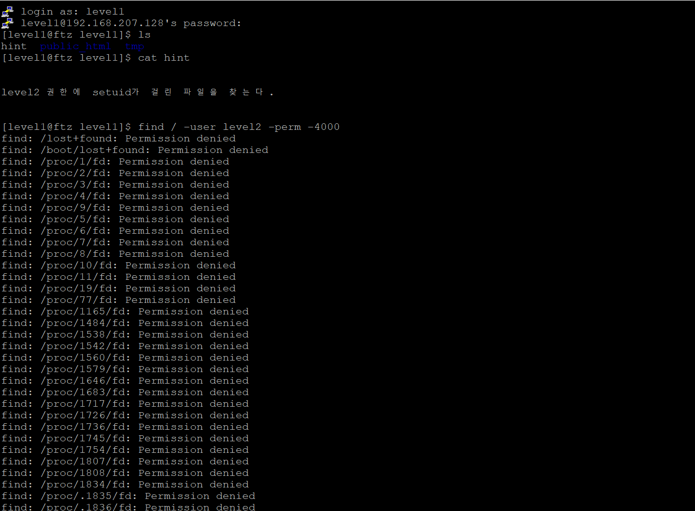

Trainer 과정에서 배웠던 대로 SetUID 권한이 있는 파일을 조작하는 것이 관건일 것이다. 이를 위해 find 명령어를 사용하여보자. 사실 -4000이 아니라 4000을 입력하는 바람에 상당히 고생해서 결국에 Write-up을 찾아보고서는 허망하게 풀이법을 찾아낸 문제이다.

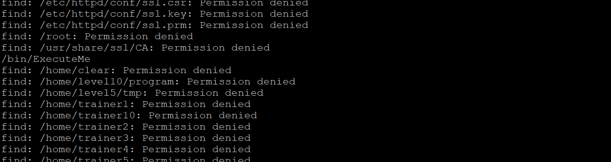

야속하게 Permission denied 사이에 끼워져 있는 실행파일 하나.

ExcuteMe를 실행하여보면,

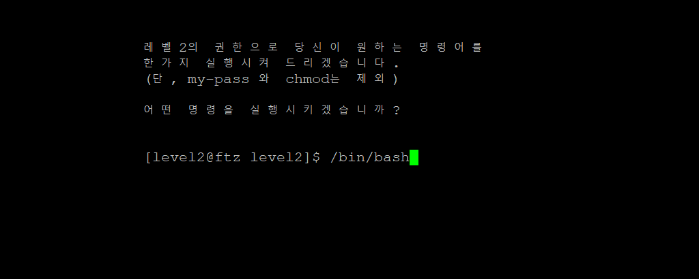

하나의 명령을 실행시킬 수 있다는 창이 나온다. 여기서 또 막혔다가 Write-up을 보고 간신히 찾았다.

사용자가 접속하면 /bin/bash의 파일을 가장 먼저 실행시킨다는 것에서 알 수 있는 대목이었을텐데.

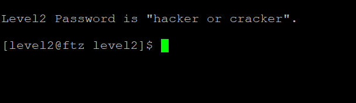

ExecuteMe에 /bin/bash를 입력하면 우리기 찾던 쉘이 나오고, 이를 이용해 my-pass를 실행시키면 키가 나온다.

#### 2) Level 2

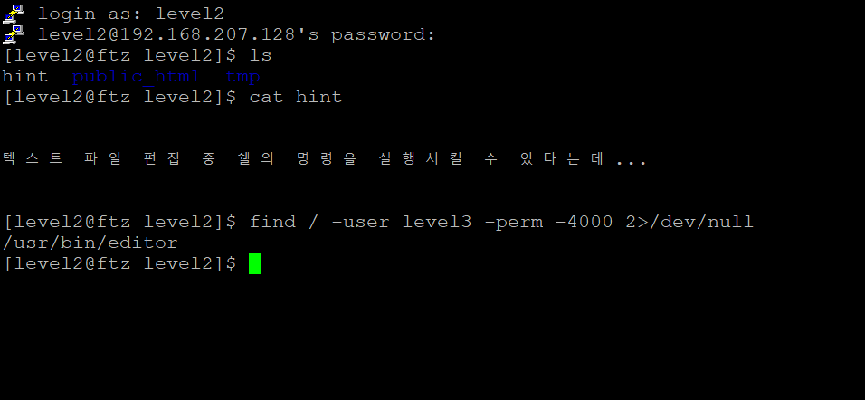

상당히 깜짝 놀랐던 문제이다.  vim에서 외부 쉘을 실행시킬 수 있는 방법이 있는 지 잘 몰랐고, 이는 공유 메모리 문제에서 코드를 짤 때 잘 이용하였다. hint를 나갔다 열기 귀찮다보니....

일단 상위 레벨의 권한을 가지고 있는 파일을 찾아보면 editor가 존재한다. 이를 이용하여 풀면 될텐데, vim이 이 에디터에 연결되어있는줄 알고 바보같이 vi를 입력해버렸다.

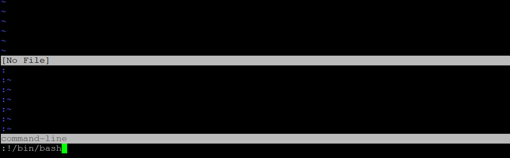

그렇게 vi의 bash를 이용해봤지만, 돌아오는 것은 Level2의 쉘. 이 vi와 저 editor가 다르다는 것을 그제서야 안 것이다.

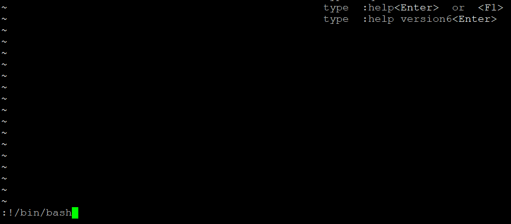

그렇게 editor의 bash를 이용하여 

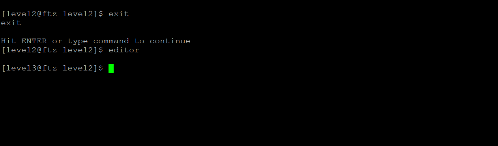

Level3의 쉘을 획득한다.

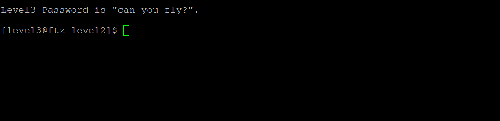

이 문장이 얼마나 얄밉던지. 이 문제를 통해서 vim 편집기 사용법도 확실히 익혀서 나중에 웹서버 구축 때 MariaDB와 Tomcat9의 서버파일들을 헤집고 다닐 때 nano없이 유용하게 사용하였다. 오히려 익숙해지면 상당히 편해질 것 같은 느낌.

#### 3) Level 3

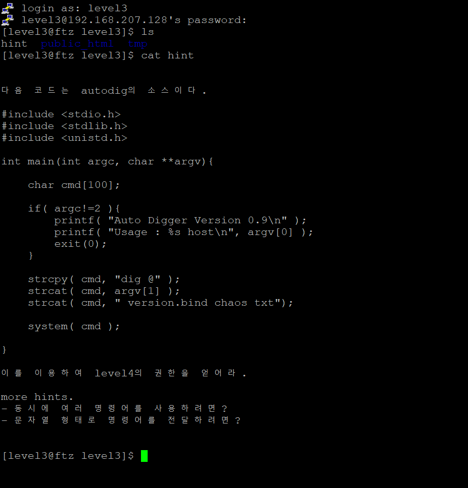

코드를 하나 던져주고서는 다음 명령어로 어떻게 넘어갈 지 알아보란다. 이 문제를 거의 유일하게 혼자 힘으로 풀었다.

일단 코드 분석하기 전에 뭐 하는 놈인지나 먼저 한 번 툭 건들여보자.

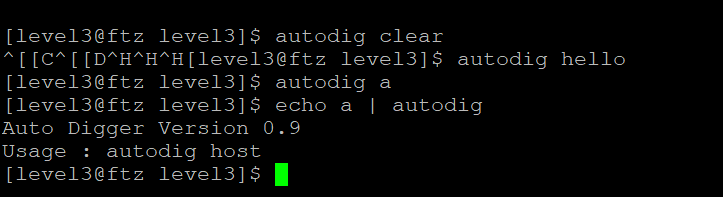

너 Auto Digger Version 0.9인거 뭐 어쩌라고.

argc는 넘어오는 인자의 개수이고, argv는 인자로 넘어온 문자열의 배열이다. 따라서 이 코드를 대충 해석해보자면, 인자가 1개 (argc는 프로그램 자신의 위치를 하나 더 인자로 삼는다) 일 때, dig@ + 인자 + version.bind chaos txt를 실행시킨단다.

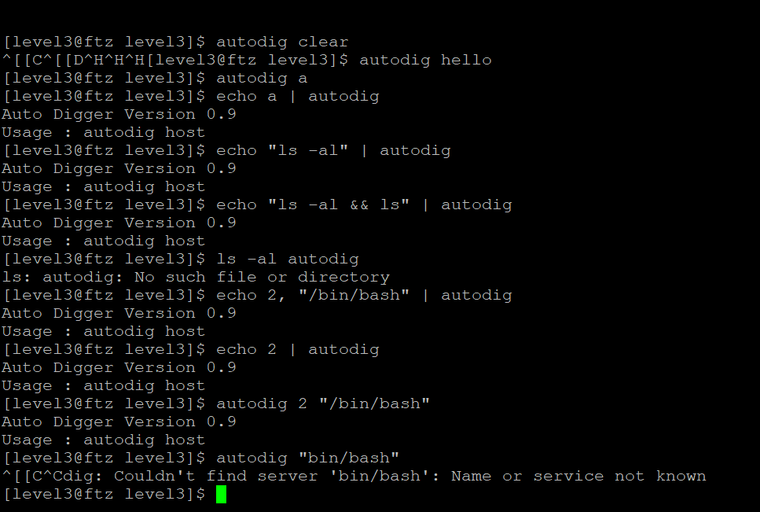

사실 argc의 인자 개수 원리를 몰라서 자꾸 2개를 주려 발악했었다.

처음에는 dig의 취약점을 분석하는 것인가 해서 dig를 찾아보니 DNS 관련 함수. 그렇게 몇 번 삽질을 하고 밑의 '동시에 여러 명령어를 사용하려면?'을 보니, 바로 생각나는 것이 있었다. $, |, ; 등의 명령을 연결해주는 기호들.

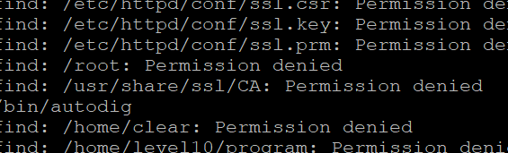

일단 autodig가 확실히 상위 레벨의 권한을 가지고 있다는 것을 확인한 후,

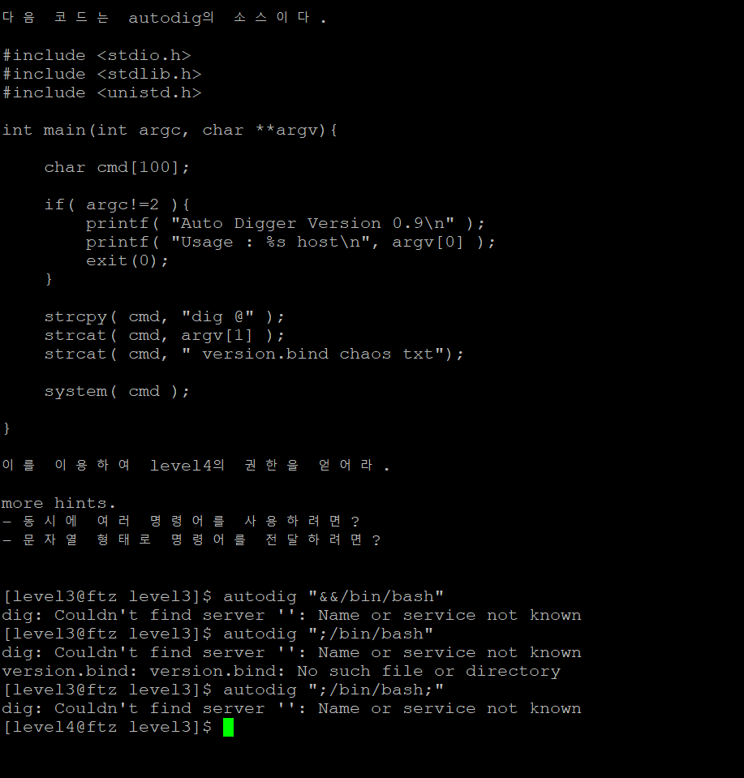

시도해보니,  Level4의 쉘이 획득된 것이 보인다. 처음으로 자력으로 푸니 얼마나 기분좋던지. 하지만 이 후 모든 문제는 감도 못잡고 Write-up이나 뒤져보게 될 줄 몰랐다.

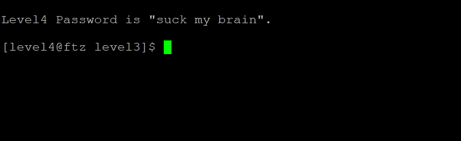

저 단어를 보니 BrainFuck이라는 프로그래밍 언어가 생각나는 것은 기분 탓일까. 아마 어셈이 BrainFuck같은 느낌이라서 그런 것일지도.

#### 4) Level 4

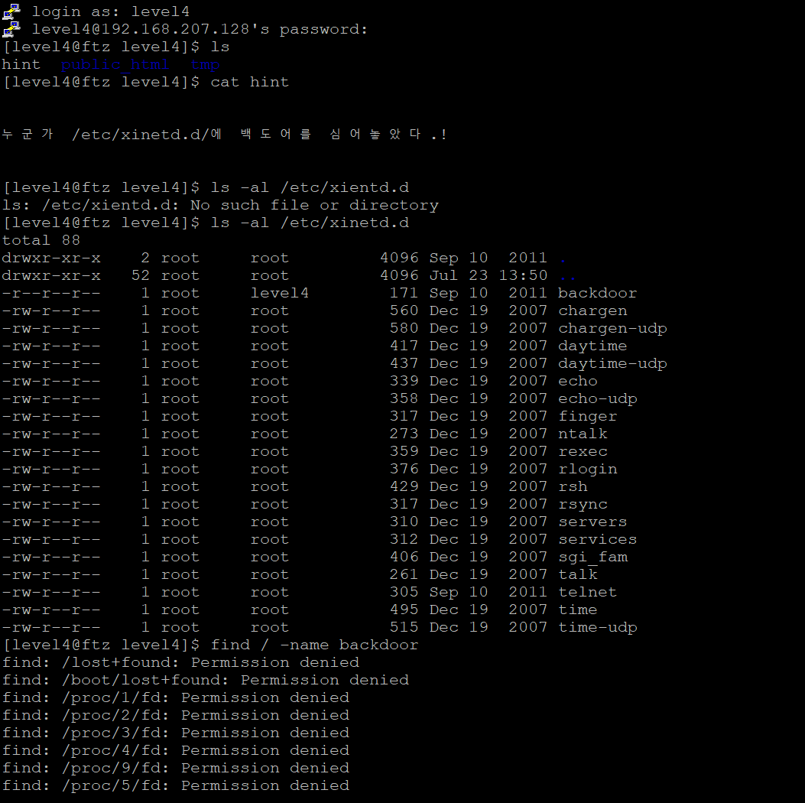

이젠 디렉터리 확인하고 cat hint가 손에 익어가기 시작하였다. /etc/xientd.d에 백도어가 있단다. 힌트따라 디렉터리에 가보니, backdoor라는 파일이 보인다. 

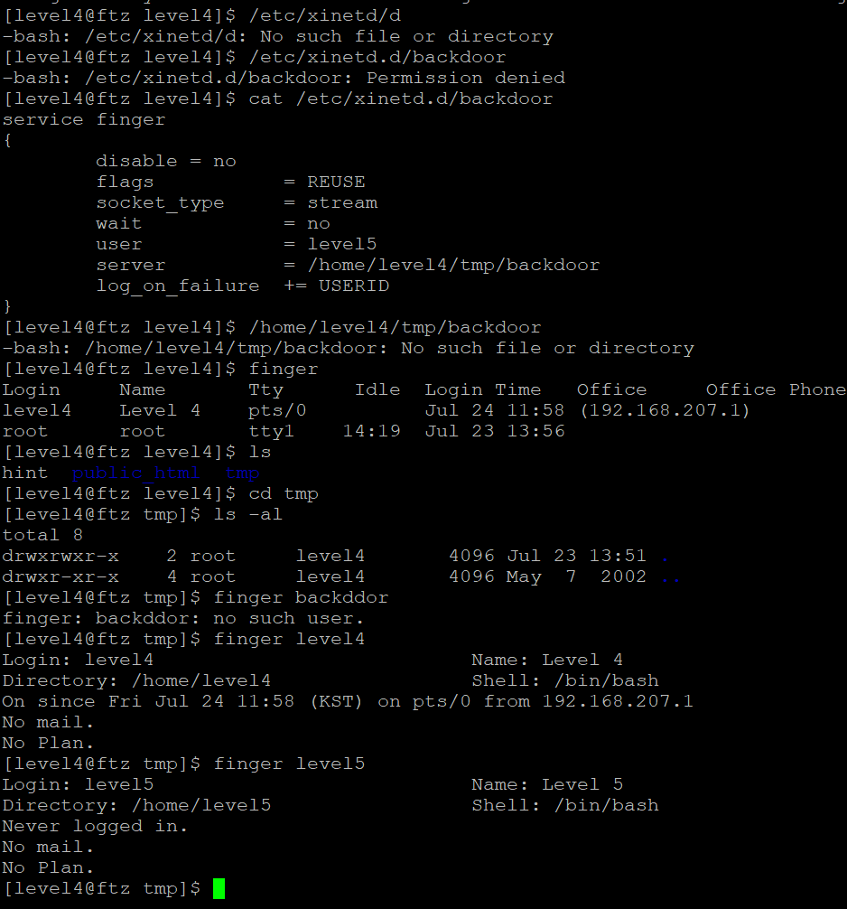

파일을 실행시키니 무슨 finger와 이상한 프로파일이 나타난다. 내가 알고 있던 Finger는 그저 유저 정보를 나타내주는 명령어일 뿐인데 이건 무슨 말이지. 도통 이해가 안간다.

결국에 Write-up을 찾아보니, 저 상태에서 finger를 치면 서버에 있는 tmp/backdoor라는 프로그램을 실행시킨단다.

도대체 무슨 원리인지는 감도 잡히진 않지만, 그렇다는데 그런 것이겠지. 그러면 실행될 백도어 프로그램을 코딩해주면 될 것이다.

대강 system("/bin/bash")를 실행시켜주는 프로그램을 vi로 작성하여 gcc로 컴파일한 후, 목표 디렉터리 안에 살포시 얹어준다. 그 다음 finger를 실행시켜주면-

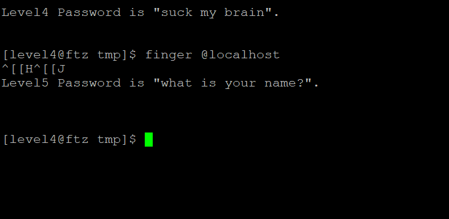

이름을 묻고 있다. 대답으로 Level4의 문구를 인용하고 싶다.

#### 5) Level 5

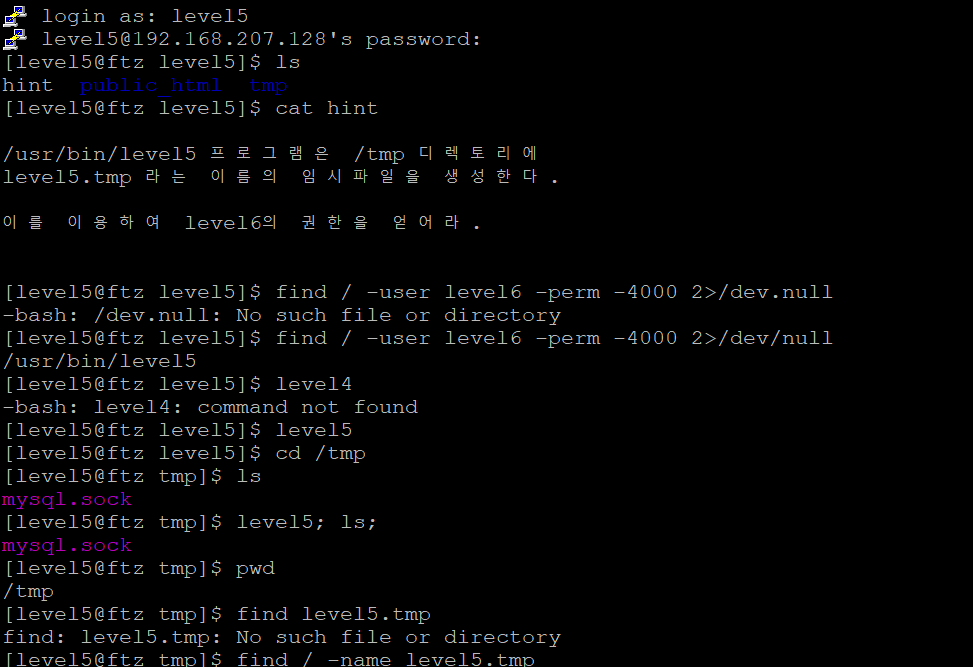

이거도 상당히 황당한 문제였는데, 임시파일이 지워지기 전에 열어볼 생각을 하지, 임시파일이 안지워지도록 할 방법은 생각도 못했단 말이다.

한 때는 mysql.sock이 생성된 임시파일의 잔해인 줄 알고 mysql 임시파일 문제인가 하며 찾아보기도 하였지만, 모두 도루묵.

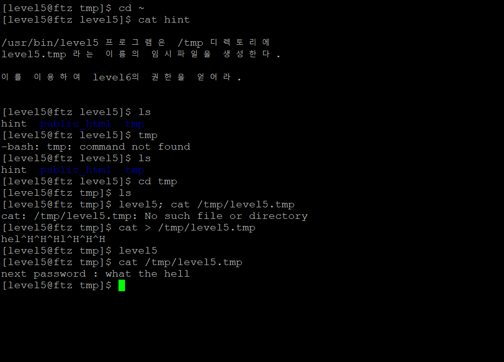

결국 Write-up 대로 파일을 임시로 작성하여 Level5 프로그램이 실행될 때 덮어씌워지도록 하게 하였다. 이렇게 되면 보통 만들어둔 파일이 똑같이 지워지지 않나. 권한 문제인가. 하여튼 난해하기 이를 데 없다.

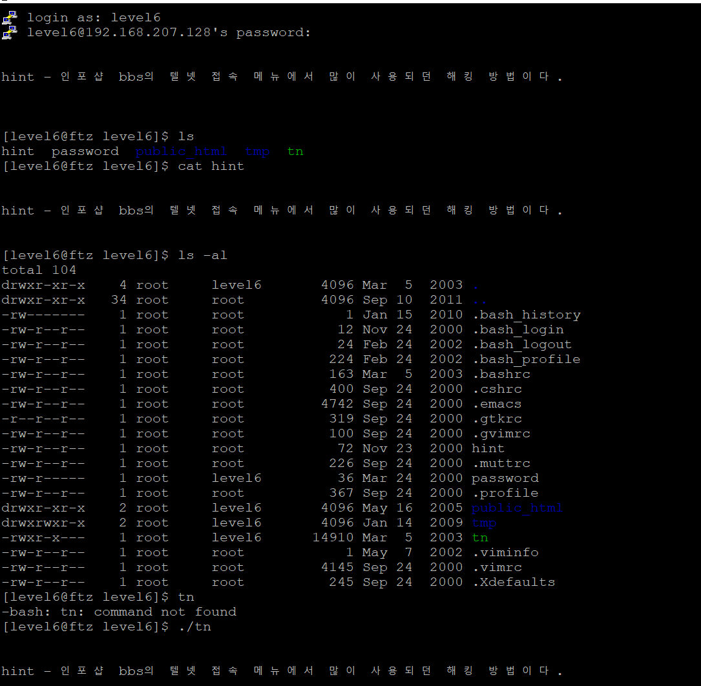

#### 6) Level 6

아니, 세기말 때의 BBS를 가지고 오다니, 생각도 못한 문제이다. BBS가 뭐하는 놈인지도 검색해본 후 알았다. 20년도 넘은 모뎀 시절의 게시판 서비스를 가지고 오면 어쩌란 것이지. 어안이 벙벙해서 Ctrl^c를 먹여볼 생각도 못하고, 안의 서버스 3개를 모두 접속해보아도 아무것도 되지 않기에, 어쩔 수 없이 Write-up을 찾아보니, Ctrl^c로 나오면 그냥 답이 있단다. 뭐지.

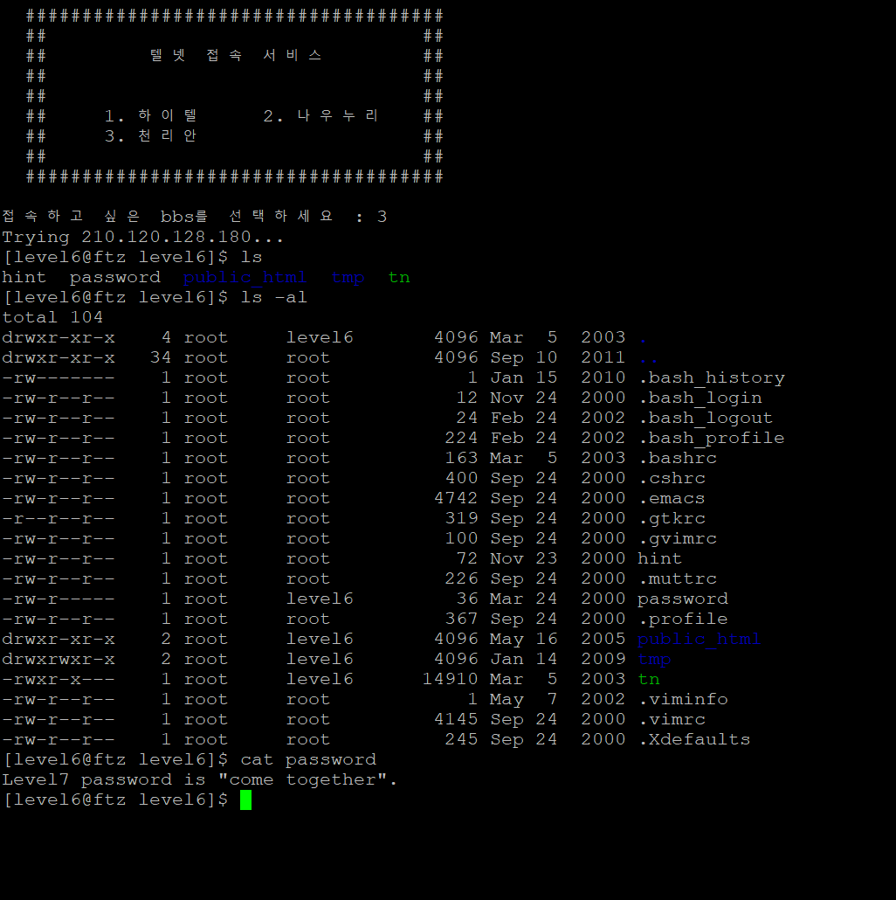

이것도 어이없어서 password 파일이 있는지도 모르고 얼탔다. 뭐, 그 때 당시에는 꽤 유용한 테크닉이었겠지만, BBS를 들어본 적도 없었는데, 이 테크닉을 과연 쓸 날이 몇 번이나 있을런지 모르겠다.

#### 7) Level 7

음..... 문제를 풀 수 있는 방법이 아예 없었다.

원래는 level7을 실행시키면 일련의 문자열이 나와서 이를 이용해 푸는 문제였는데, 다운받은 FTZ는 모종의 이유로 문자열이 실종되어 풀 수 없는 상태였다. 처음에는 Wrong.txt가 없어서 이걸 찾는건가 했었는데, 수상해서 찾아봤는데 역시나. 밑에 보다시파, 문자열을 넣어주니, 그 문자열 그대로 출력하는 모습이 보인다.

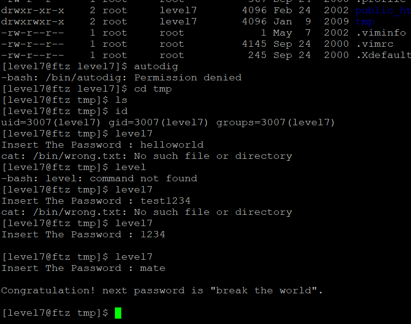

인터넷에서 찾은 문자열에을 2진수로 변환한 후, 이를 아스키코드로 만들면 문제 해결이다. 문자열이 있었으면 충분히 풀 수 있었을 듯 하니, 아깝기만 하다.

#### 8) Level 8

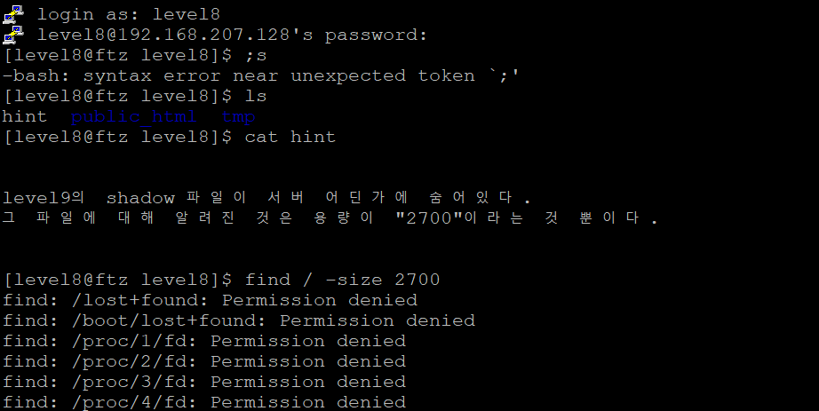

2700뒤에 단위를 붙여야 한다는 사실을 까맣게 잊고 해맑게 2700을 입력했다가 안나오는 결과에 얼탄 모습이다. 그래서 Find가 숨김파일을 인식못하나 싶어서 Find로 숨김파일을 찾는 법을 치기도 하고. 단위인 c를 붙여줘야 한다는 사실을 알았을 때 얼마나 당황했던지.

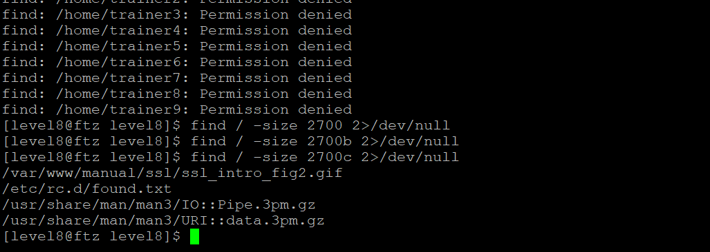

found.txt가 나타난 모습이다. 이를 열어보면

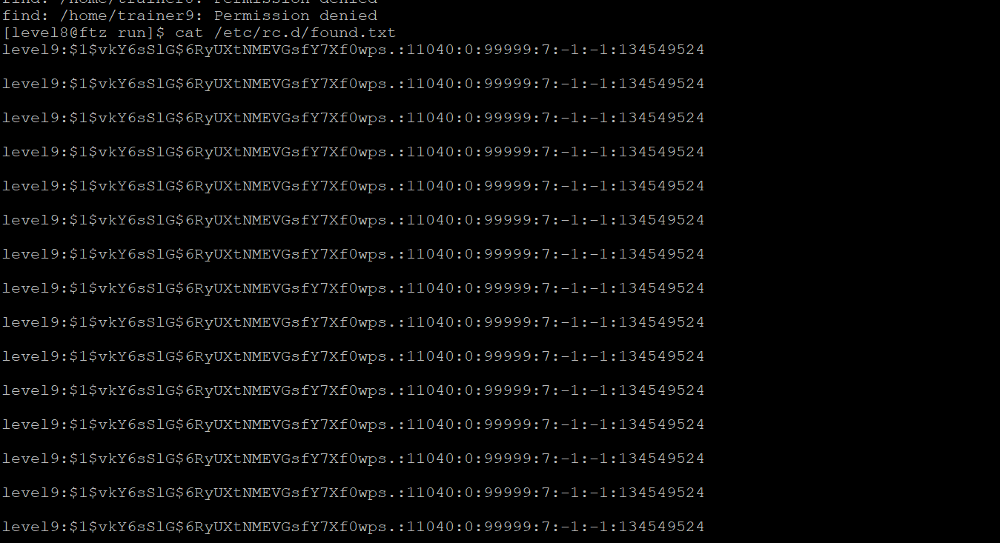

요런 파일이 나오게 되는데, 이거 딱봐도 shadow 파일이다. 힌트에서 말한 shadow파일이 이놈일테다. 이를 복호화하는 방법을 찾아보니, John the Ripper라는 프로그램이 있단다. 그리고 밑은 이 프로그램을 깔기 위해 했단 발악의 흔적이다.

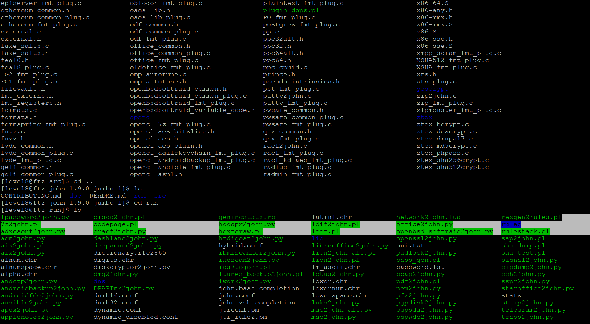

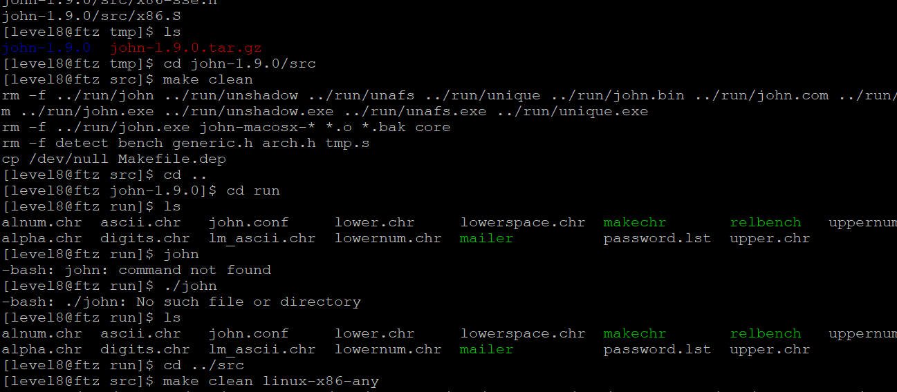

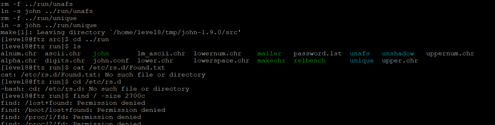

처음에 잘 모르고 jumbo를 가져왔다가 컴파일이 안되어 한동안 고생하고...... 결국엔 순수 John the Ripper를 나중에 발견해 가져와보니 컴파일이 너무나 깔끔하게 잘만 된다. 물론 jumbo의 문제가 아니라 명령어를 잘못 썼을 가능성이 매우 높긴 하지만. 하여튼 그렇게 컴파일한 John the Ripper를 이용해 Shadow파일을 복호하면

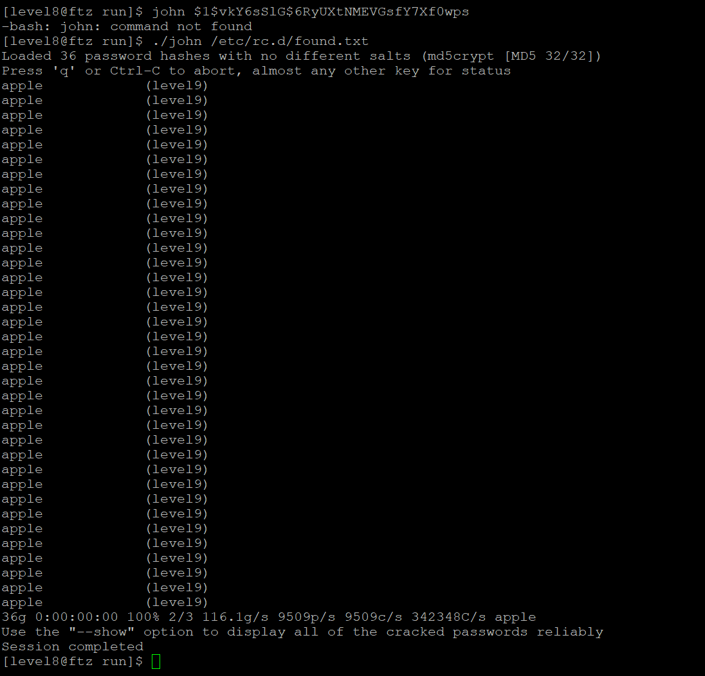

깔끔하게 나온다.

#### 9) Level 9

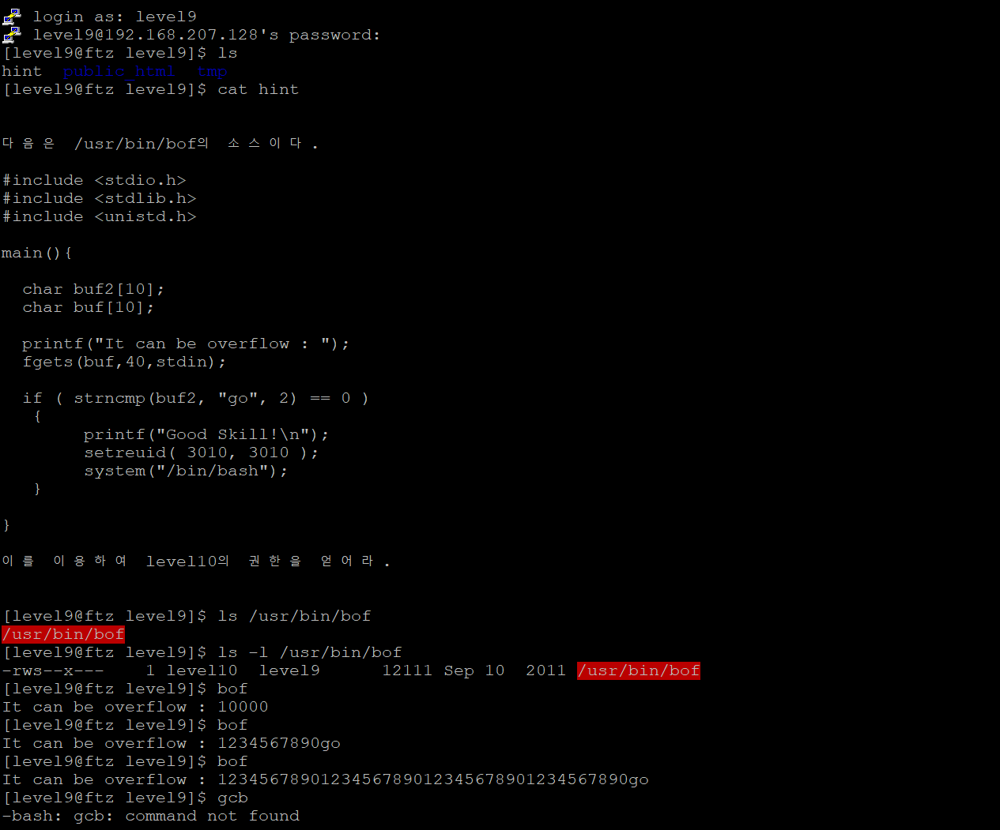

프로그램의 이름과 두 버퍼를 보자마자 든 생각은

" 아, 이게 그 버퍼오버플로우인가 뭐인가? "

분명 메모리상 두 버퍼는 붙어있을 것이고, C의 문자열과 입력 관련 함수들은 버퍼의 크기를 확인하지 않는 문제가 있다. 그럼 뻔하지 뭐.

두 메모리가 붙어있을 것이라 예상하고 10을 채운 후, 뒤에 go를 입력하니 안된다. 어라, 뭔가 이상한데. 입력버퍼 자체를 오버플로우내야하나? 40칸을 채우고 go를 넣는다. 안된다.

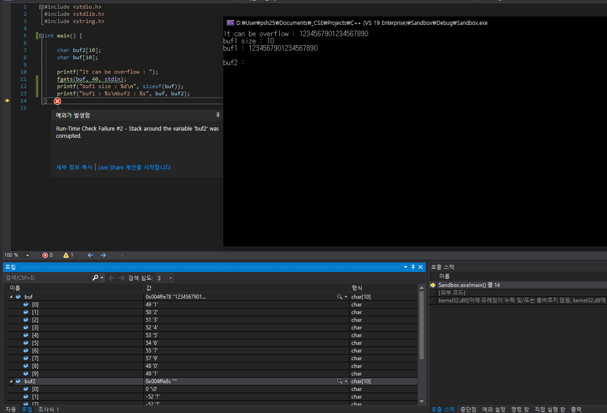

비주얼 스튜디오에서도 도저히 어떻게 된건지 감이 안잡힌다. 애초에 세그먼트 에러를 칼같이 잡아내는 비주얼 스튜디오라......

이번에도 어쩔수 없이 Write-up을 보니, 직접 소스코드를 컴파일하여 디스어셈블리해보면 buf가 16바이트로 잡힌단다. 도대체 어떻게 되먹은건지.

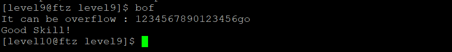

그렇게 16개를 입력한 후에 go를 입력하면 문제는 풀리게 된다.

하......

#### 10) Level 10

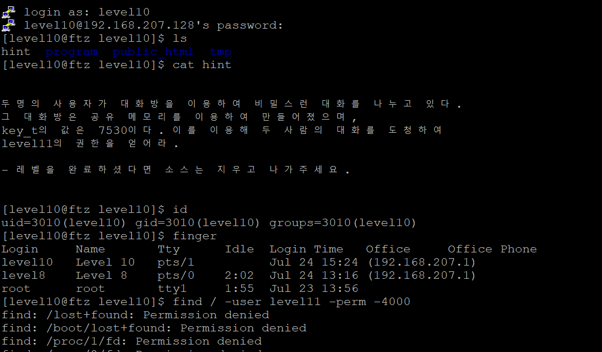

공유메모리 문제이다.

shm 함수들을 쓰는건데 이게 세마포어인가 뭐인가 하여튼 그렇다고 한다. 그렇게 shm을 배워 코드를 열심히 짜보나, 잘될리가

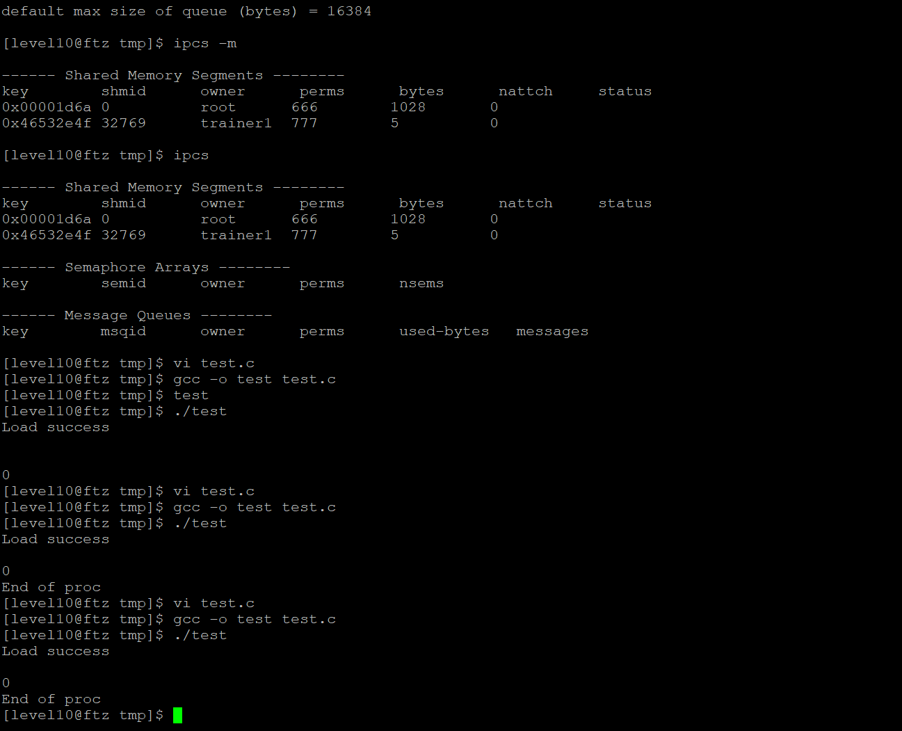

그렇게 몇 번의 시행착오 (대부분은 포인터의 자료형 일치 문제였다)를 거쳐 코드를 shm 예문에 가깝게 뜯어고치고 한 결과......

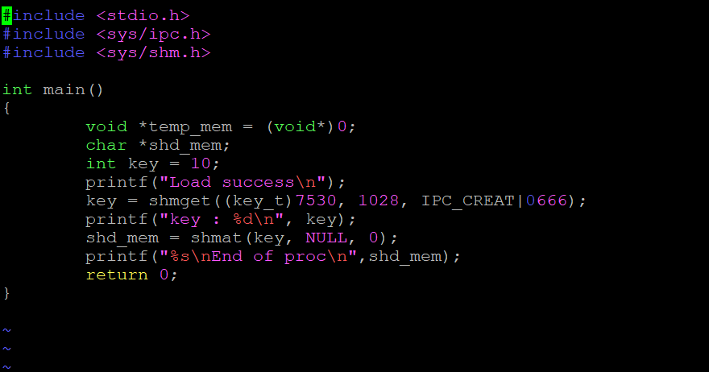

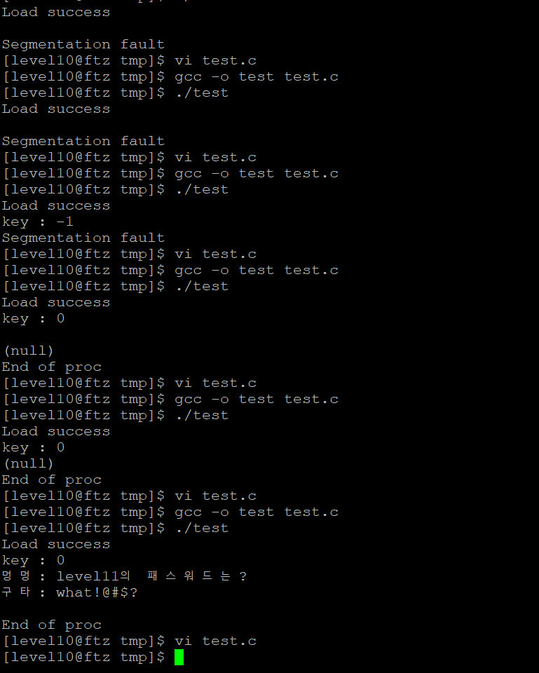

뚫렸다.

실제로 꽤나 유용해보이는 공격법이었는데, 당장 ipcs 명령어를 이용하면 공유메모리의 크기와 키를 얻을 수 있기 때문이었다. 물론 이렇게 보안에 취약하다는 사실을 아마 프로그래머들도 모를리가 없기 때문에 쉽사리 공유메모리를 무방비상태로 사용하진 않겠지만, 다른 공격 기법과 함께 사용한다면 상당히 위험하게 다가올 것이라 느껴졌다.