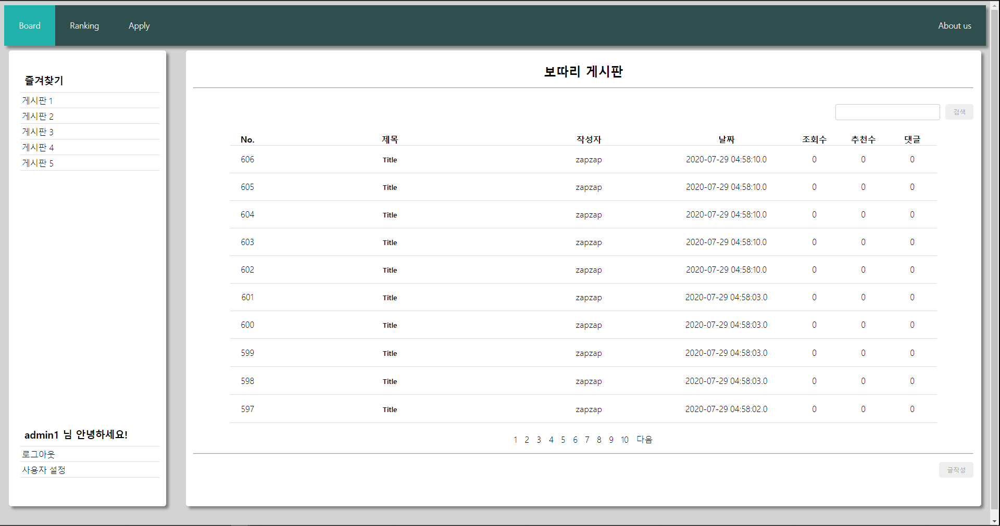
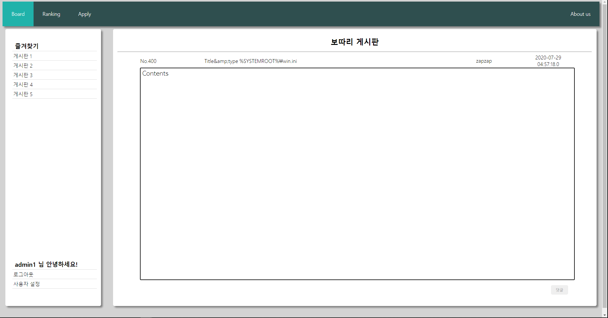
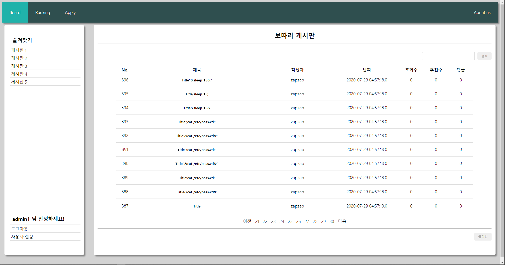
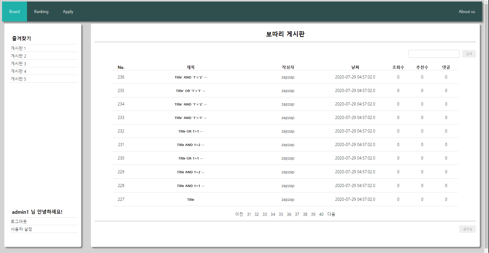
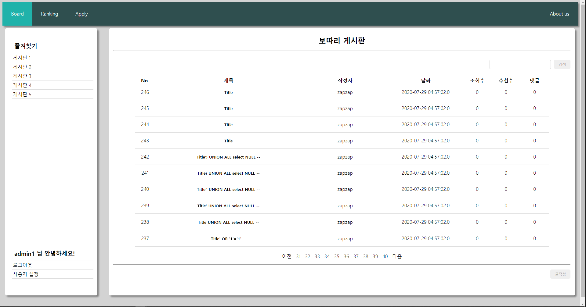

# 취약점 분석 리뷰 - OWASP ZAP

### 1. 분석 전

이번 사이트 분석 과제가 들어왔을 때, 개인적으로는 상당히 난처하였다. 기본적인 보안이 어느정도 되어있는 JSP 기반에다 개발하는 동안에도 보안을 신경써서 프로그래밍하여 Directory Traversal 공격이나 Stored/Reflect XSS, SQL Injection과 같이 초심자가 도전해볼만한 대부분의 공격이 막혀있는 상황이었기 때문이다.

 특히 XSS쪽이 상당히 튼튼하였는데, 기본적으로 JSP에서 HTMLEscaping을 거쳐 출력시키기도 하였고, JSTL은 자동으로 Escaping을 지원해주기 때문이었다. 사실상 따로 Escaping을 해주지 않아도 JSP단에서 매우 잘 막아주고 있었기 때문에 XSS를 통해서는 사실상 공격이 불가능하였다. 다만, 이후에 프로필 수정란에서 XSS를 대비한다는 것을 깜빡하고 안막았는데, 밝혀진 3가지의 공격 중 하나가 되었다. XSS가 안되니 당연히 Open Redirect 공격이나 CSRF와 같은 공격도 같이 막혔다.

Directory Traversal이나 잘못된 인자 전달의 경우도 XSS와 같이 사실상 공격이 불가능하였는데, JSTL로 버튼을 선택적으로 출력하기도 하였고, Form을 통해서 ID를 전송할 일이 있으면 도착지에서 세션ID와 전달받은 ID를 항상 확인하였기에 이 또한 공격할 방법이 없었다. 심지어 회원탈퇴와 같은 기능도 대화창을 통해서 한 번 확인받기 때문에 다른 사이트의 XSS를 통해 URL Spoofing 또한 막을 수 있게 되어있었다. 아마 초급 해킹 레벨에서 해당 사이트를 공격하는 거의 유일한 방법은 타 사이트에서의 XSS를 통한 CSRF정도밖에 없을 것이라 생각한다.

 SQL Injection이 그나마 가장 대비가 덜 되어있었으나, ConnecterJ에 PreparedStatement 클래스를 이용한 질의 때문에 사실상 공격은 대부분 막혔을 것이다. 로그인 단에서도 select와 or을 필터링하여 가장 위험한 곳인 로그인쪽은 추가적으로 보강하기도 하였다.

이러한 시국이니, 웹해킹 입문자에게는 너무나도 버거운 벽이 나타난 것이다. 애초에 추가해놓은 기능도 많지 않았고. 랭킹을 구현하기에는 드림핵에서 포너블을 공부하는 것이 시간이 너무 많이 걸려 뭘 어쩌질 못하였다. 아는 사람에게 해킹을 부탁하여봤지만, 역시 기능이 많지 않은 편인지 결국에는 아무것도 하지 못하였다. 해볼만한 것이라 해봤자 로그인 Brute Force 정도? 하지만 서버의 성능이 좋은 편도 아닌지라, Brute Force를 하면 서버가 뻗을게 분명하였다.

### 2. 분석 시작

내가 아는 구멍을 다 막아놓고 구멍을 뚫는다는 것은 모순이다. 그래서 준비한 것이 취약점 분석 툴이었다. 일단 취약점 분석 툴이면 나보다는 취약점을 더 잘 찾을 것이니 그 쪽을 알아봤는데, 마침 OWASP에서 무료로 제공하는 취약점 분석 툴이 있었다. OWASP ZAP. 그래서 이 취약점 분석 툴을 설치하고 한동안 만지작거리면서 게시판을 엉망으로 만들어내는 것을 시도하였다. 컨텍스트를 생성해주고, 글작성과 검색, 그리고 프로필 변경 (사실상 이 기능이 끝이니까.)을 해보니, ZAP이 이것을 학습해서 그에 맞는 공격을 Active 스캔해주었다. 그렇게 게시판과 DB는 엉망이 되었다.

이 놈, 무려 글을 600개나 싸질렀다. 물론 파일 업로드 구현을 위해 Form을 Multipart로 구성한 것이 그 이유가 될 것이다. 물론 파일 업로드에 사용했던 cos.jar 라이브러리가 Multiple을 지원하지 않아 현재 개발을 잠깐 멈춰두어 작동하지 않았지만. 실제로 보면, 제목과 내용이 변하는 글 또한 부지기수이다.

윈도우의 환경변수를 이용해 Directory Traversal을 시도하는 Zap. 하지만, JSP의 벽은 상당히 강력하였다.

Command Injection과 XSS 또한 HTMLEscaping을 이기지 못하였다.

PreparedStatement를 통한 쿼리에 의해서 SQL Injection까지 모두 막혔다.

다만, 게시글 페이지에서 HTML이 2번 필터링되는 것은 고쳐야 할 부분일 것이다.

특기할 것은 Ajax였는데, Ajax의 응답을 받고 글목록 JSON을 보내주는 서블릿에서 문제가 하나 있었다. 바로 특수문자가 JSON에서 필터링되지 않아 발생한 문제인데, JSON에 Escaping되지 않은 특수문자가 들어가자, JSON 구조가 깨지면서 Ajax를 담당하는 서블릿의 Response가 오염되어 문제를 일으켰다. 이 또한, 이 후에 JSON Escaping까지 철저하게 하여 막았다.

이렇게 두어번 걸렀으니 보안 문제는 대부분 비교적 Critical하지 않은 부분, 예를 들면 XSS 방지 플래그 등에서 나타났는데, Critical한 문제가 3건 정도 발생하였다. 이 때 속으로 얼마나 안심했는지 모른다. 만약 아예 안나왔으면 사이트가 전문가의 손으로 갈텐데, 그렇게 되면.......

### 3. 분석 후

참으로 다행스럽게도, 문제는 3곳에서 나왔다. Stored XSS, Reflect XSS, Buffer Overflow. 프로필 쪽에서 나타난 XSS 빼고는 모두 당장 서버를 털릴 문제는 없는 것이다.

별로 기능도 없는 사이트 주제에 막기는 매우 까다롭게 막아서 그런지, 이 정도면 충분히 만족한다. JSP가 왜 보안에 비교적 강력한지 드디어 이해하게 되는 계기가 되었는데, PHP에서 발생한다는 문제들이 모두 JSP 앞에서는 대부분 사용할 수 없었기 때문이다. 유일하게 걱정했던 것은 Ajax였지만, 다행스럽게도 큰 문제가 되진 않았다.

사이트 자체가 인터넷 프로그래밍에서 만점을 받고도 가산점을 54점 더 받을 정도로 예쁘장하게 나와서 그런지, 아무래도 당분간은 개인 게시판이나 방명록처럼 계속 열어둘 생각이다. 동네방네 퍼뜨려서 어떻게 공격하는지 확인해보고 싶다.