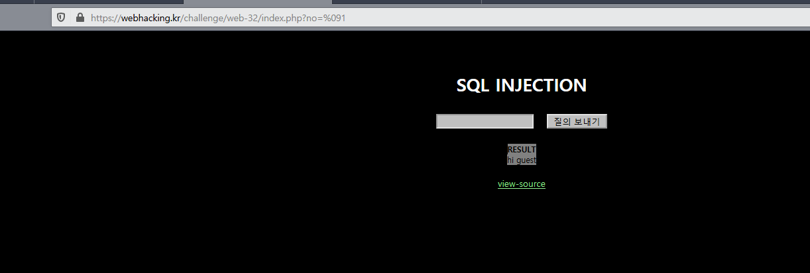

# Week_3_Write-Up

##### 서론

오랜만에 하는 웹해킹이라 감이 많이 죽었을까봐 걱정하는 마음이 컸지만, 15번을 10분만에 풀어내는 것을 보고서는 안도감에 가슴을 쓸어내렸다. 최근에 Dreamhack에서 열심히 강좌를 공부했었는데, 거기서 봤던 테크닉들이 상당히 유용했다. 의외의 것들도 많이 알게 되었는데, Buffer Overflow가 Assembly단이 아닌, C언어와 같이 고수준에서도 충분히 분석할 수 있다는 점에서 상당히 놀랐다. 어셈블리의 Stack Frame을 공부하면서 배운 것도 많고, 이번에 어셈블리 스터디를 들어 x86 프로세서와 NASM 어셈블리를 어느 정도 완성하고 나면 본격적으로 포너블을 다뤄보고 싶다는 마음이 들었다.


#### 1. Webhacking.kr No.24

##### 1) 문제 분석


갑자기 뜬끔없이 내 IP주소를 보여주니 당황스럽기 그지없다.

밑에 view-source를 확인하여 보자.

```php+HTML
<?php
  include "../../config.php";
  if($_GET['view_source']) view_source();
?><html>
<head>
<title>Challenge 24</title>
</head>
<body>
<p>
<?php
  extract($_SERVER);
  extract($_COOKIE);
  $ip = $REMOTE_ADDR;
  $agent = $HTTP_USER_AGENT;
  if($REMOTE_ADDR){
    $ip = htmlspecialchars($REMOTE_ADDR);
    $ip = str_replace("..",".",$ip);
    $ip = str_replace("12","",$ip);
    $ip = str_replace("7.","",$ip);
    $ip = str_replace("0.","",$ip);
  }
  if($HTTP_USER_AGENT){
    $agent=htmlspecialchars($HTTP_USER_AGENT);
  }
  echo "<table border=1><tr><td>client ip</td><td>{$ip}</td></tr><tr><td>agent</td><td>{$agent}</td></tr></table>";
  if($ip=="127.0.0.1"){
    solve(24);
    exit();
  }
  else{
    echo "<hr><center>Wrong IP!</center>";
  }
?><hr>
<a href=?view_source=1>view-source</a>
</body>
</html>
```

코드를 분석하여보면.

1. Server와 Cookie를 Extract한다.
2. $REMOTE_ADDR를 $ip로 가져온다.
3. $ip를 str_replace를 이용해 필터링한다.
4. $ip가 127.0.0.1이면 Solve.

여기서 처음에 든 생각은, 'REMOTE_ADDR이 127.0.0.1이면 Response가 루프백으로 전송될텐데?'였다. 프록시를 통해 패킷을 변조해 보내 solve(24)를 실행시킨다 쳐도, 여기서는 확인할 길이 없을 것이다. 그러면 어디서 바꿔치기해야하는 지 고민하던 찰나에, $REMOTE_ADDR을 $ip로 대입시키는 모습에서 "왜 굳이 $ip로 변수를 옮기지?"라는 생각을 하였고, 그 해답은 위의 extract($_COOKIE);에 있었다. 최근 드림핵에서 PHP의 보안 취약점으로 쿠키의 이름이 Request 변수를 덮어씌울 수 있다는 것을 공부하였다. 그렇다면.......

##### 2) 풀이 과정

쿠키에 REMOTE_ADDR를 생성하고, 그 안에 임의의 문자열을 삽입한 후, 새로고침 해보니.......


예상대로이다. 쿠키를 추출하면서 $REMOTE_ADDR이 덮어씌워졌고, $ip에는 쿠키에 있던 $REMOTE_ADDR이 들어간 것이다. 이제는 다음으로 str_replace를 해결하면 되는데, 이것또한 어려운 것이 아니었다. 입력하고자 하는 값은 127.0.0.1이고, 12와 7., 0., ..이 바뀐다. 이러한 점을 생각하여 String을 구상하여보면 쉽다.


그렇게 완성된 문자열은  "112277...00...00...1". 이것을 쿠키값에 넣고 결과를 확인해보자.

##### 3) 결과 확인


(거위는 무시하자)

제대로 작동한 것이 보인다.

#### 2. Webhacking.kr No.18

##### 1) 문제 분석


 SQL Injection이라고 대놓고 박혀있다.

그 말은, SQL Query문과 Filtering에서 막히지 않은 벽이 하나 있다는 말일 것이다. 소스코드를 통해서 확인해보도록 하자.

```php+HTML
<?php
  include "../../config.php";
  if($_GET['view_source']) view_source();
?><html>
<head>
<title>Challenge 18</title>
<style type="text/css">
body { background:black; color:white; font-size:10pt; }
input { background:silver; }
a { color:lightgreen; }
</style>
</head>
<body>
<br><br>
<center><h1>SQL INJECTION</h1>
<form method=get action=index.php>
<table border=0 align=center cellpadding=10 cellspacing=0>
<tr><td><input type=text name=no></td><td><input type=submit></td></tr>
</table>
</form>
<a style=background:gray;color:black;width:100;font-size:9pt;><b>RESULT</b><br>
<?php
if($_GET['no']){
  $db = dbconnect();
  if(preg_match("/ |\/|\(|\)|\||&|select|from|0x/i",$_GET['no'])) exit("no hack");
  $result = mysqli_fetch_array(mysqli_query($db,"select id from chall18 where id='guest' and no=$_GET[no]")); // admin's no = 2

  if($result['id']=="guest") echo "hi guest";
  if($result['id']=="admin"){
    solve(18);
    echo "hi admin!";
  }
}
?>
</a>
<br><br><a href=?view_source=1>view-source</a>
</center>
</body>
</html>
```

여기서 SQL Query는 "select id from chall18 where id='guest' and no=$_GET[no]"인데, 여기서 다음 줄에 guest인 것이 확인되면 guest 아이디로 인식되므로, where 문 전체를 무력화시킬 필요가 있을 것이다. 그러나, preg_match에서 여러 특수문자와 select, from, 0x, 공백이 필터링된다. 여기서 union은 select와 from이 필터링 되었으니 쓸 수 없고, 선택지는 or과 and만이 남는다. +가 필터링되지만 효과가 없는 듯 하다. 이 공백을 어떻게 만들어낼 것인가.

##### 2) 풀이 과정

유심히 보니, 필터링 되지 않은 특수문자가 하나 보인다. 탭.


하지만 탭을 눌러도, 옆 버튼으로 포커스가 옮겨질 뿐, 탭이 입력되진 않는다. 그러면 다른 곳에서 탭을 복사해서 붙여넣는 것은?



작동한다! 이것과 or을 조합하여 admin인 테이블을 가져와보자.

"	2	or	id="admin""

와 같이 공격 쿼리를 구성하여 공격해보았다.

##### 3) 결과 확인


공격코드가 성공적으로 작동한 것이 보인다.

#### 3. Webhacking.kr No.16

##### 1) 문제 분석


WASD에 따라 저 노란색 별이 움직이고, 마우스를 갖다대면 조그만 별들은 사라지며, 랜덤한 색깔들이 영롱하게 수를 놓는 영문모를 사이트가 보인다.

일단 누가봐도 JS로 보이니, F12를 눌러서 JS 코드를 확인해보자.

```html
<script> 
document.body.innerHTML+="<font color=yellow id=aa style=position:relative;left:0;top:0>*</font>";
function mv(cd){
  kk(star.style.left-50,star.style.top-50);
  if(cd==100) star.style.left=parseInt(star.style.left+0,10)+50+"px";
  if(cd==97) star.style.left=parseInt(star.style.left+0,10)-50+"px";
  if(cd==119) star.style.top=parseInt(star.style.top+0,10)-50+"px";
  if(cd==115) star.style.top=parseInt(star.style.top+0,10)+50+"px";
  if(cd==124) location.href=String.fromCharCode(cd)+".php"; // do it!
}
function kk(x,y){
  rndc=Math.floor(Math.random()*9000000);
  document.body.innerHTML+="<font color=#"+rndc+" id=aa style=position:relative;left:"+x+";top:"+y+" onmouseover=this.innerHTML=''>*</font>";
}
</script>
```

이 부분에 아마 답이 숨겨져 있을 것이다.

##### 2) 풀이 과정

코드를 대충 해석해보자. mv함수는 보나마나 body같은 곳에 이벤트 리스너로 걸려 있는 함수가 분명하다. 아마 키를 누르면 그에 맞는 cd값이 넘어오고, kk를 통해 작은 별을 만들어낸 후, cd값에 따라 저 별이 움직이는 것이리라. 그런데, 어울리지 않는 코드가 하나 보인다.

```javascript
if(cd==124) location.href=String.fromCharCode(cd)+".php"; // do it!
```

입력값이 십진수 124라면, php 페이지로 향한다고? 아스키값 124의 문자는 " | "이다. 한 번 이 문자를 입력하여보자.

##### 3) 결과 확인


너무나도 쉽게 풀려버린 것을 확인할 수 있다. URL에 들어가 있는 "|.php"는 덤. 이렇게 간단한 문제가 앞으로도 죽 나오면 행복하련만.

#### 4. Webhacking.kr No.16

##### 1) 문제 분석